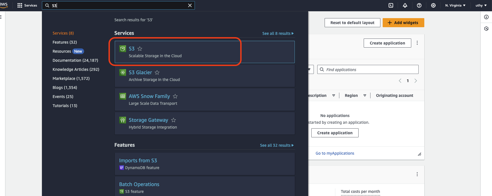
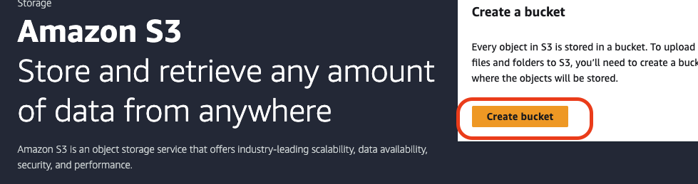
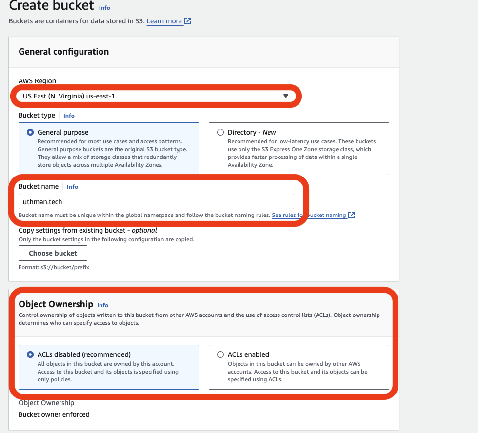
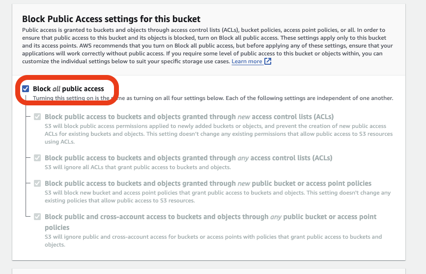
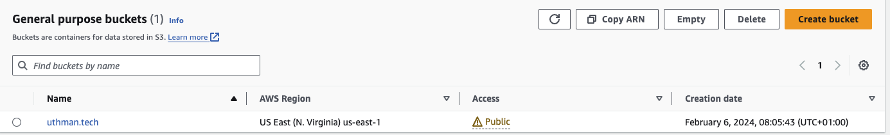
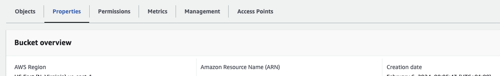
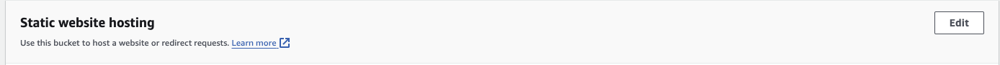
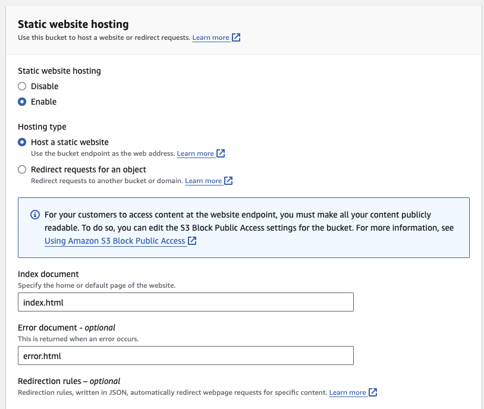
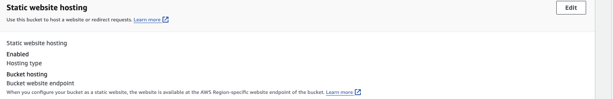

# Deploy a static website on s3 and connect it to a custom domain through route53 on AWS

## S3 (Simple storage service)
Amazon S3  bucket is a global storage platform, it is also an object storage where data is stored inside s3 buckets called objects

### Some of the use case of Amazon S3
- Backup and storage
- Disaster recovery
- Static website
- Media hosting

## Route 53
Route 53 is a DNS service managed by aws and through it we are able to configure our routes for dns server

These 2 services are essential in order to deploy a static website with a custom domain

#### Here is an architecture diagram

The first step is to create an s3 bucket 
- Navigate to the s3 service in the aws console by using the search bar
   
&nbsp;
- Click on the create bucket button to create a new bucket
  
  &nbsp;
  
- Select an aws region of your choice 
- Then enter a bucket name, it is very important to know that when creating a static website in s3 the bucket name has to be the same with the domain name, I made this mistake the first time i created mine 
- For the object ownership we select the ACLs disabled as we do not intend to control access to objects individually
  
- We uncheck the block all public access checkbox since we want everyone to have access to our website 
- The click the create button to create an s3 bucket
  
- The next step is to enable static website hosting for the bucket, we click on the created bucket which navigates us to another page
  
- Click on the properties tab and scroll down until you see the static website hosting
  
- Click on the edit button on top right to enable it
  
- Next thing is to check the enable static website hosting 
- For the hosting type we select the host a static website 
- Then input the index document name which is index.html, the error document is optional 
- Then click on the save changes button and we have successfully enabled static website hosting on our bucket
  
 