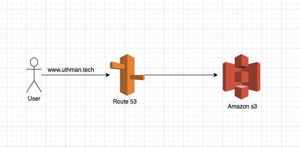

# Deploy a static website on s3 and connect it to a custom domain through route53 on AWS

## S3 (Simple storage service)
Amazon S3  bucket is a global storage platform, it is also an object storage where data is stored inside s3 buckets called objects

### Some of the use case of Amazon S3
- Backup and storage
- Disaster recovery
- Static website
- Media hosting

## Route 53
Route 53 is a DNS service managed by aws and through it we are able to configure our routes for dns server

These two services are essential to deploying a static website with a custom domain.

#### Here is an architecture diagram


The first step is to create an s3 bucket 
- Navigate to the s3 service in the aws console by using the search bar.
   
&nbsp;
- Click the create bucket button to create a new bucket.
  
  &nbsp;
  
- Select an aws region of your choice 
- Then enter a bucket name, It is  Important to know that when creating a static website in S3, the bucket name has to be the same with the domain name, I made this mistake the first time i created mine.
- For object ownership, we select the ACLs disabled as we do not intend to control access to objects individually.
  
- We uncheck the block all public access checkbox since we want everyone to have access to our website. 
- Then click the create button to create an s3 bucket.
  
- The next step is to enable static website hosting for the bucket, we click on the created bucket which navigates us to another page.
  
- Click the properties tab and scroll down until you see the static website hosting.
  
- Click the edit button on top right to enable it.
  
- Next thing is to check the enable static website hosting.
- For the hosting type we select the host a static website.
- Then input the index document name which is index.html, the error document is optional. 
- Then click the save changes button and we have successfully enabled static website hosting on our bucket.
  

The next thing to do is to add our index and error objects.
- Click the created bucket to navigate to the next page.
  
- Click the upload button on top right to navigate to the next page.
  
- Click the add files button to add index and error objects.
- After adding them click the upload button to upload them.
  

One last thing we need to do is to give access to our objects.
- Click the permission tab and look for the bucket policy.
  
- Click the edit button on the top right of the bucket policy.
  
- We can edit our policy here or we can use a [Policy generator](https://awspolicygen.s3.amazonaws.com/policygen.html)
- After adding our policy it will generate something like this.
 ````json
  {
  "Version": "2012-10-17",
  "Id": "Policy1707156938123",
  "Statement": [
    {
      "Sid": "Stmt1707156935241",
      "Effect": "Allow",
      "Principal": "*",
      "Action": "s3:GetObject",
      "Resource": "arn:aws:s3:::uthman.tech/*"
    }
  ]
}
 ````
- Add the generated json to your bucket policy and save changes.
  
- Now our object is publicly accessible.

The next thing is to set up our route53.
- We'll follow the same step as we did for s3,go to the search bar enter route53 and click on it to navigate to route 53 page.
- Click on the Get started button to navigate to the next page.
- I have a domain I got whogohost so i don't need to register a domain on aws.
  
- We are going to make use of the hosted zones for this so check the create hosted zones and click on the Get started button.
  
- Enter your registered domain and add description if desired
- Select a type and we are going for the public hosted zone since we want it on the internet then click the create hosted zone.
  
- How hosted zone is created successful, next thing to do is set up record, click on the created hosted zone to navigate to the next page.
  
- If you did not get your domain on aws,we need to update the name server so we copy the ones on aws and update it on the platform we purchased our domain.
- Next thing is to create a record, we click on the create record button on top right.
  
  
- Select a record type which is the A that suit our needs.
- Since we would be connecting our s3 with route53, we need to toggle the Alias.
- And choose an endpoint and the one we would be selecting is Alias to S3 website endpoint.
- Choose a region, the region selected has to be the region where our s3 bucket resides.
- Then Enter S3 endpoint, this will automatically reflect as we click on it, select the endpoint of the bucket created.
- Then click on the create records button.
  
- Record is created successfully, we need to wait for few mins for it to propagate.
- After a successful propagation.


